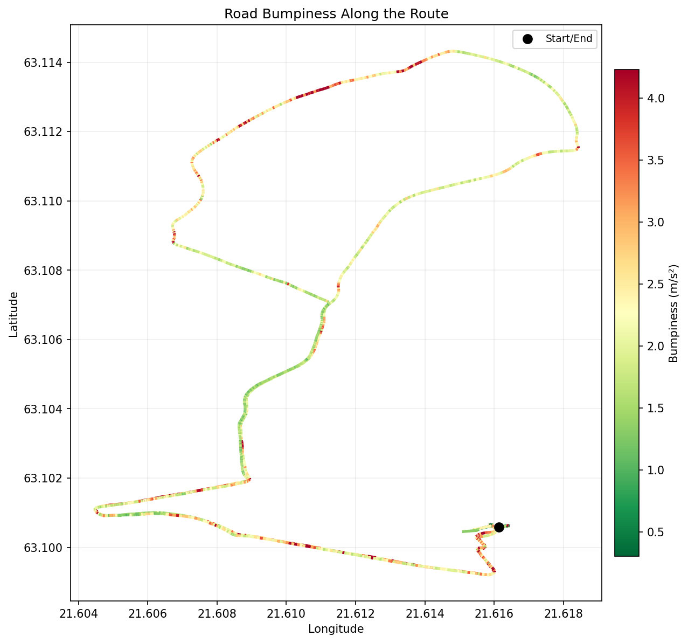
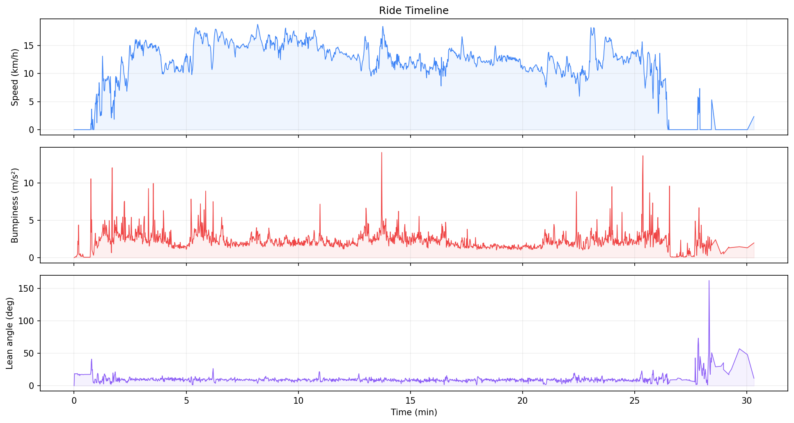
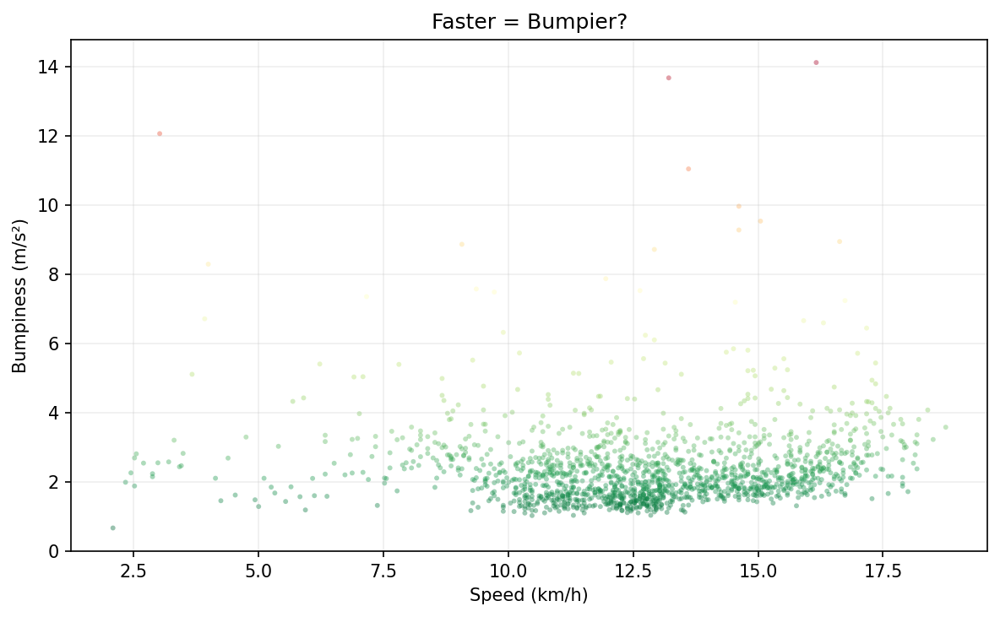

# bike-road-quality

biked from home to the playground and back with my phone on the handlebar mount, logging all the sensors. wanted to see which stretches of the route are actually smooth and which ones are terrible.

## the map

route colored by accelerometer vibration intensity. green = smooth, red = rough.



you can clearly see the rough patches. the section heading south from the turnaround point is noticeably worse than the northern stretch. and there's a consistently bumpy bit near the start/end, probably where the road surface changes.

## the ride

speed, bumpiness, and bike lean angle over the 30-minute ride:



the bumpiness spikes are pretty obvious -- a few big jolts from potholes or speed bumps, and then sustained rough sections. average speed was about 13 km/h, max 19 km/h.

the lean angle at the very end goes haywire because i was messing with the phone to stop the recording.

## faster = bumpier?



not really. most of the ride clusters in the 1-3 m/s² bumpiness range regardless of speed. the extreme bumps are scattered across all speeds -- they're road features (potholes, surface changes), not a speed thing.

## numbers

```
duration: 30.3 min
avg speed (moving): 12.8 km/h
max speed: 18.8 km/h

bumpiness (while moving):
  mean: 2.42 m/s²
  max:  14.13 m/s²
  rough segments: 28

hard braking events: 7
```

## how it works

pretty simple. for each GPS second, i grab all the accelerometer readings in that window (~54 samples), compute the RMS of `|acceleration_magnitude - 9.81|` (i.e. strip gravity, measure what's left), and that's the bumpiness score. higher vibration = rougher road.

lean angle comes from the orientation sensor's roll axis. braking is just GPS speed differences.

the map is colored using matplotlib's `LineCollection` with a green-to-red colormap. the streamlit app uses folium for an interactive version where you can toggle between bumpiness, lean, and speed overlays.

## setup

```
pip install -r requirements.txt
```

extract sensor data from the .mat file (once):

```
python extract_mat_data.py
```

run analysis:

```
python run_analysis.py
```

interactive dashboard:

```
streamlit run app.py
```

## data

phone sensor logger on my bike handlebar mount -> MATLAB export -> python CSVs. the .mat file uses timetable objects which scipy can't directly read, so the extraction script digs into the binary workspace blob (see extract_mat_data.py).

sensors: accelerometer ~54Hz, gyro/magnetometer/orientation ~10Hz, GPS ~1Hz.
